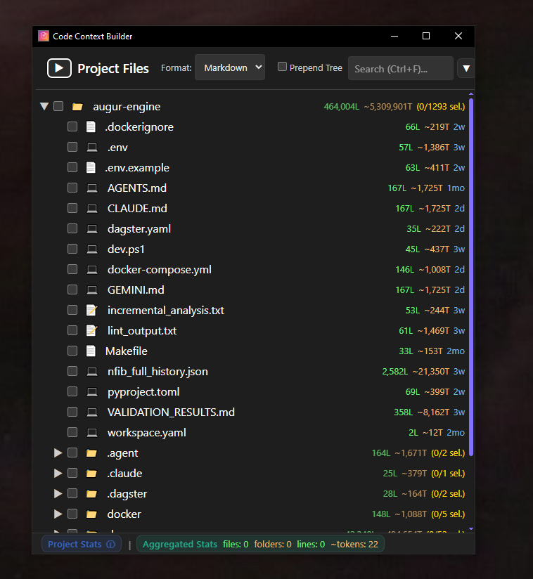
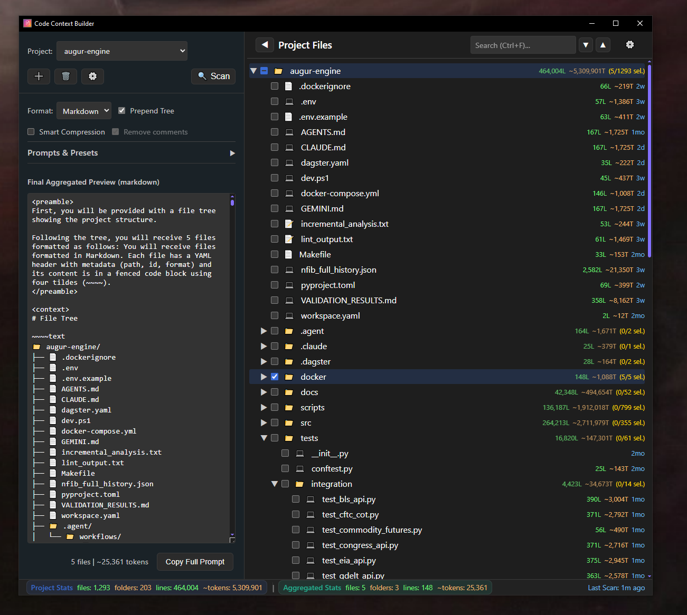
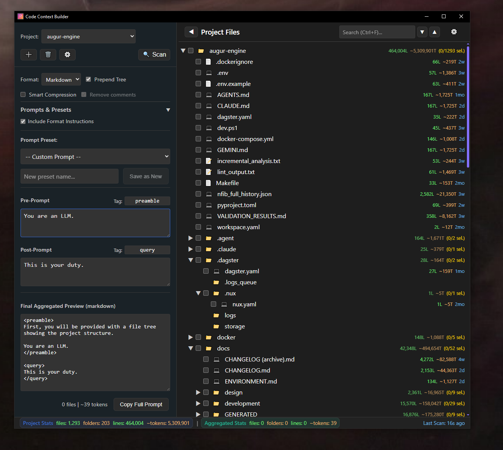
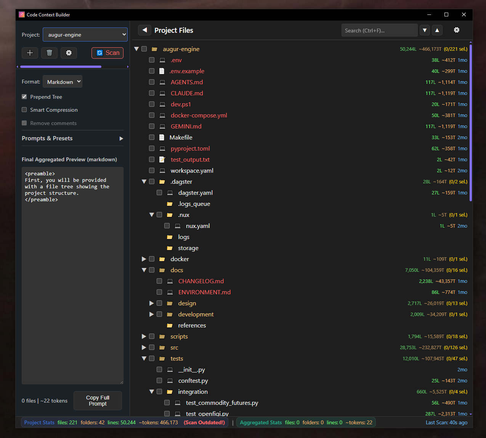
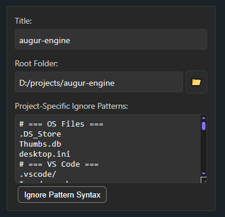

# Code Context Builder

A powerful, keyboard-driven desktop application for creating high-quality, LLM-optimized prompts from your codebase. Designed for maximum efficiency with intuitive hotkeys and a streamlined workflow. Built with Tauri, React, and Rust.



## Download

### Pre-built Binaries (Recommended)

Download the latest release for your platform:

- **Windows:** Download `.exe` from [latest release](https://github.com/jatoran/code_context_builder/releases/latest)
- **Linux:** Download `.deb` or `.AppImage` from [latest release](https://github.com/jatoran/code_context_builder/releases/latest)
- **macOS:** Download `.dmg` from [latest release](https://github.com/jatoran/code_context_builder/releases/latest)

All platforms are built automatically via GitHub Actions.

### Build from Source

See [Installation](#installation) section below for build instructions.

## Why I Built This

Because manually copying code into LLMs is tedious, and with expensive pro models, **every token counts**.

This tool helps you curate precise context, track token usage, and work at keyboard speed when you need to feed your code to any chat interface.

## Features

- **Smart Project Scanning**: Efficiently scans project folders with customizable ignore patterns
- **Interactive File Tree**: Browse, search, and select files with detailed stats (lines, tokens, size)
- **Multiple Output Formats**:
  - **Sentinel** - Loud, unambiguous markers (recommended for LLMs)
  - **Markdown** - YAML front matter with unique fences
  - **XML** - Well-formed XML documents (recommended for tooling)
  - **Raw** - Unformatted concatenation
- **Smart Code Compression**: Optional compression using tree-sitter for Python and TypeScript/TSX
  - Removes comments and collapses function bodies while preserving structure
  - Reduces token count for large codebases
- **Prompt Presets**: Save and reuse common prompt structures with customizable pre/post prompts
- **Real-time File Monitoring**: Detects file changes and prompts for re-scanning
- **Token Counting**: Accurate token count estimation using tiktoken
- **Customizable Format Instructions**: Edit default instruction templates for each output format
- **Project Management**: Manage multiple projects with per-project ignore patterns
- **Dark/Light Themes**: System-aware theme support
- **Keyboard-Driven Workflow**: Comprehensive hotkey support for lightning-fast operation without touching the mouse

## Keyboard-Driven Workflow

Code Context Builder is designed for efficiency with comprehensive keyboard shortcuts that let you work at the speed of thought:

### Essential Hotkeys

| Shortcut | Action |
|----------|--------|
| `Ctrl+F` | Focus search (quickly find files) |
| `Ctrl+A` | Select all files in the tree |
| `Ctrl+Shift+A` | Deselect all files |
| `Ctrl+Shift+C` | **Copy final prompt to clipboard** (most-used action!) |
| `Ctrl+Shift+R` | Re-scan current project |
| `Ctrl+Shift+M` | Cycle output format (Markdown → Sentinel → XML → Raw) |
| `Ctrl+Shift+T` | Toggle "Prepend Tree" option |
| `Ctrl+↓` | Expand tree level (Ctrl+Click for all levels) |
| `Ctrl+↑` | Collapse tree level (Ctrl+Click for all levels) |

### Search Navigation

When searching for files:
- `↓` / `↑` - Navigate through search results
- `Enter` - Toggle selection of highlighted file
- `Esc` - Clear search and unfocus

### Intuitive Workflow Example

1. `Ctrl+F` → Type filename → `Enter` to select
2. Repeat for all needed files
3. Edit prompts in the sidebar
4. `Ctrl+Shift+C` to copy the complete, formatted prompt

**No mouse required!** The entire workflow can be completed with just the keyboard, making it incredibly fast once you learn the shortcuts.

## Screenshots

### 📁 File Tree & Output Formats
Select files from your project tree and see the formatted output in real-time. The interface shows file stats (lines, tokens, size) and supports multiple output formats.



### 🎯 Prompt Presets
Save and reuse common prompt structures. Create custom pre-prompts (instructions) and post-prompts (tasks) for different LLM workflows.



### 🔄 Real-Time File Monitoring
The app detects when files have been modified since the last scan and alerts you with a visual indicator, ensuring your context is always up-to-date.



### ⚙️ Customizable Ignore Patterns
Use `.gitignore` syntax to exclude files and directories from your scans. Perfect for filtering out dependencies, build artifacts, and other non-essential files.



## Installation

### Prerequisites

- [Node.js](https://nodejs.org/) (v18 or higher)
- [Rust](https://www.rust-lang.org/tools/install) (latest stable)
- [npm](https://www.npmjs.com/) or [yarn](https://yarnpkg.com/)

### Build from Source

1. Clone the repository:
```bash
git clone https://github.com/jatoran/code_context_builder.git
cd code_context_builder
```

2. Install dependencies:
```bash
npm install
```

3. Run in development mode:
```bash
npm run tauri dev
```

4. Build for production:
```bash
npm run tauri build
```

The built application will be in `src-tauri/target/release/`.

## Usage

### Creating a Project

1. Click "New Project" in the Project Manager
2. Enter a project title and select the root folder
3. (Optional) Add custom ignore patterns using `.gitignore` syntax
4. Click "Scan" to index the project

### Building Prompts (The Fast Way)

**Quick workflow:**
1. `Ctrl+F` to search for files → `Enter` to select
2. Expand the "Prompts & Presets" section
3. `Ctrl+Shift+M` to cycle through formats if needed
4. Write your Pre-Prompt (instructions) and Post-Prompt (task), or load a preset
5. `Ctrl+Shift+C` to copy the complete formatted prompt

**Traditional workflow:**
1. Browse and click files in the tree (or use search with `Ctrl+F`)
2. Expand the "Prompts & Presets" section
3. Choose a format (Sentinel, Markdown, XML, or Raw)
4. Either:
   - Load a saved preset, or
   - Write custom Pre-Prompt (instructions) and Post-Prompt (task)
5. Toggle options:
   - **Prepend Tree**: Include file tree visualization
   - **Include Format Instructions**: Add format explanation
   - **Smart Compression**: Enable code compression (Python/TS/TSX only)
6. Copy the final prompt from the preview (or press `Ctrl+Shift+C`)

💡 **Pro Tip**: Once you learn the hotkeys, you can go from opening the app to having a complete prompt on your clipboard in under 10 seconds!

## Architecture

Code Context Builder uses a modern tech stack:

- **Frontend**: React + TypeScript + Vite
- **Backend**: Rust + Tauri
- **Database**: SQLite (stored next to executable)
- **Parsing**: tree-sitter for code compression
- **Tokenization**: tiktoken-rs for accurate token counting

See [DOCUMENTATION.md](DOCUMENTATION.md) for detailed technical documentation.

## Contributing

Contributions are welcome! Please read [CONTRIBUTING.md](CONTRIBUTING.md) for guidelines.

## License

This project is licensed under the MIT License - see the [LICENSE](LICENSE) file for details.

## Acknowledgments

- Built with [Tauri](https://tauri.app/)
- Code parsing with [tree-sitter](https://tree-sitter.github.io/)
- Token counting with [tiktoken-rs](https://github.com/zurawiki/tiktoken-rs)

## Support

If you encounter any issues or have questions, please [open an issue](https://github.com/jatoran/code_context_builder/issues).
